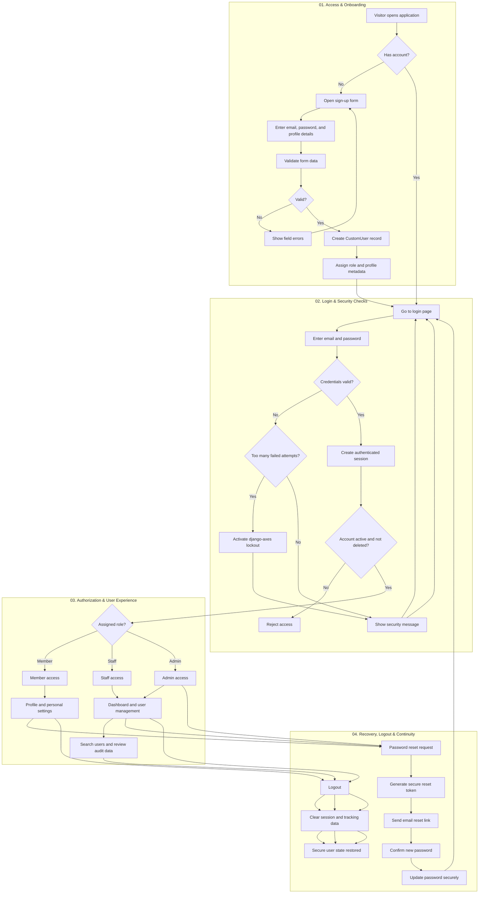

# User Authentication Flow — Multi-Section Process Design

## Flow explanation

This flowchart is structured in four main sections, inspired by a real-world system design layout:

1. Access & Onboarding
2. Login & Security Checks
3. Authorization & User Experience
4. Recovery, Logout & Continuity

The process moves from visitor to registered user, then to authenticated access, then to role-based authorization, and finally to secure recovery and logout states.

This keeps the design visual, process-oriented, and closer to a professional system architecture diagram rather than plain text-only explanation.
